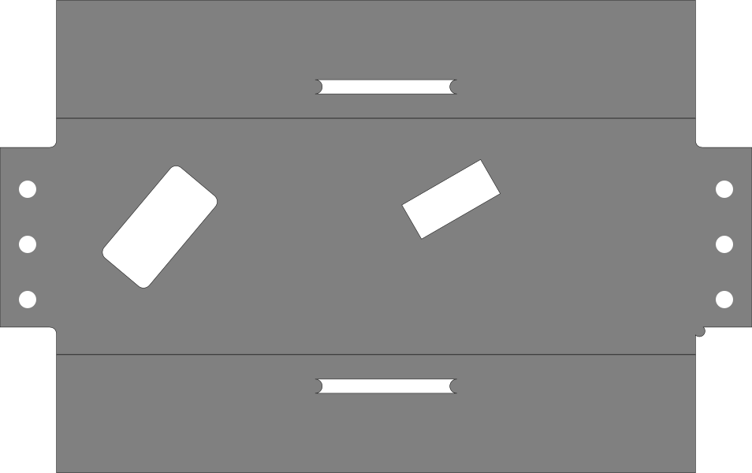

# DSTV: A Rust Crate for Parsing DSTV Files and Visualizing as SVG

## Overview

Welcome to the DSTV crate repository! This Rust crate is designed to parse DSTV (NC/NC1) files and visualize them as SVG (Scalable Vector Graphics). DSTV is a format extensively used in the steel industry for exchanging data about steel parts. 

## Features

- **Robust DSTV Parsing:** The DSTV crate can parse DSTV files quickly and accurately, tackling complex or large files with ease.
- **SVG Visualization:** The parsed DSTV data can be converted into SVG for convenient and scalable visualization.
- **High Performance:** Written in Rust, this crate is optimized for high performance and low resource usage.

## Installation

To install DSTV, add it to your `Cargo.toml` file:

```toml
[dependencies]
DSTV = "0.1.0"
```

Then run `cargo build` to download and compile the DSTV crate along with your project.

## Usage

Here's a basic example of how to use DSTV to parse a DSTV file and generate an SVG:

```rust
use dstv::prelude::*;
let dstv = Dstv::from_file("./tests/data/0008-SE0009.nc1");
assert_eq!(dstv.is_ok(), true);
// Declare the dstv as mutable, as `to_svg` will reorder the elements for the
// best representation
let mut dstv = dstv.unwrap();
assert_eq!(dstv.header.order_identification, "PROJECT-1");
let svg = dstv.to_svg();
```

### Examples

#### Single faced plates:


#### Multi facing definitions such as rectangular tubes and U profiles



## Contribution

Contributions to the DSTV are welcome. If you find a bug or have a feature request, please open an issue. If you want to contribute code, please open a pull request.

## License

This project is licensed under the MIT License.

## Disclaimer

This library is provided as-is, and while we strive for quality, we cannot guarantee that there will never be any bugs or issues.

## Contact

If you have any questions or comments about DSTV, feel free to contact us.
